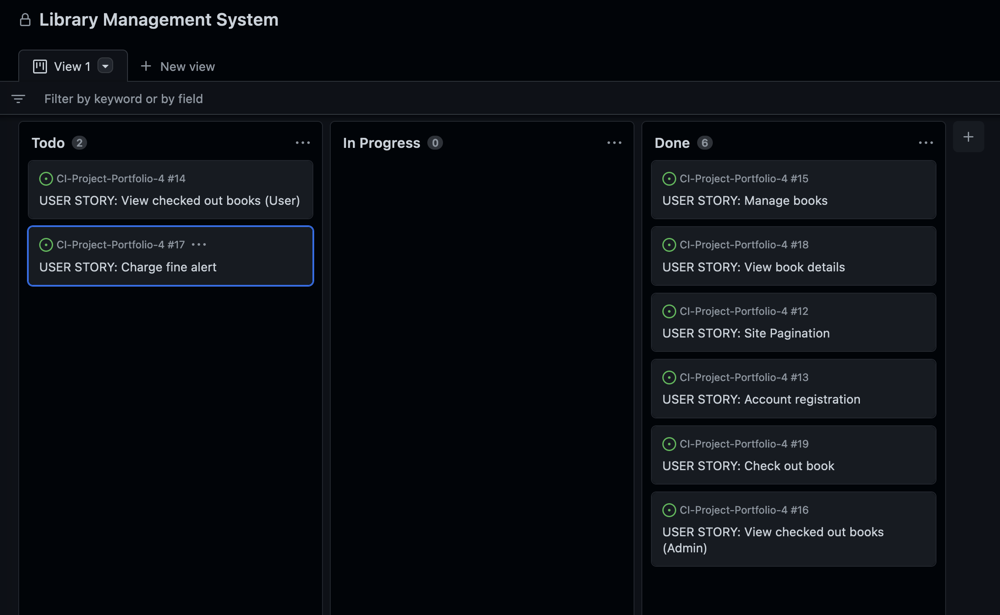
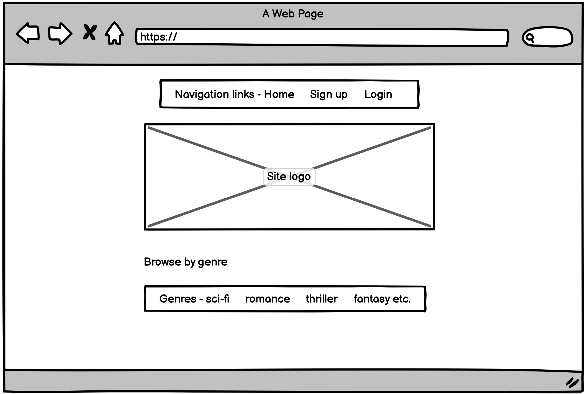
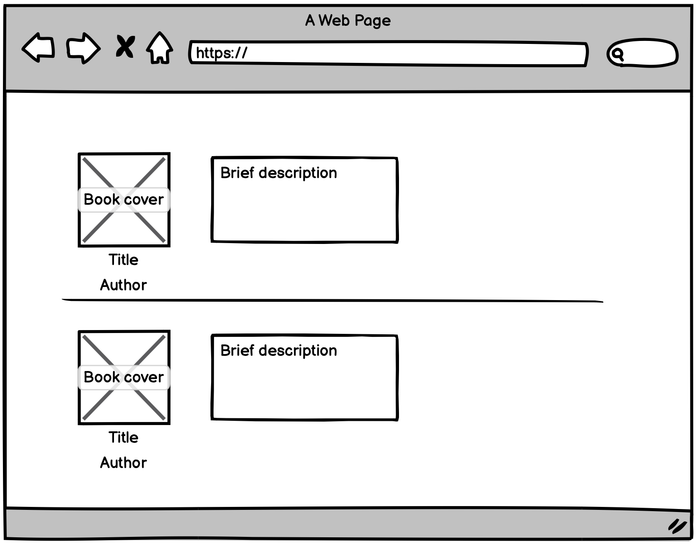
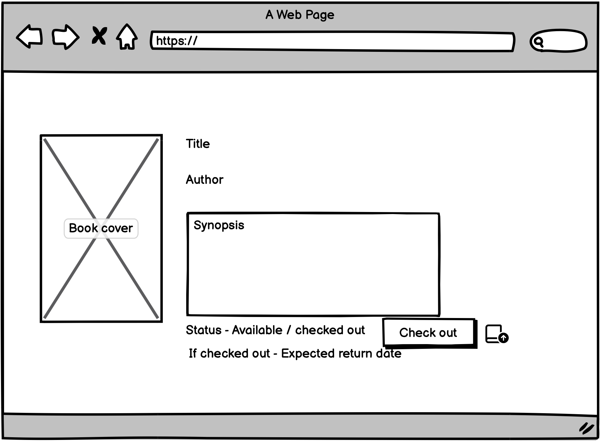
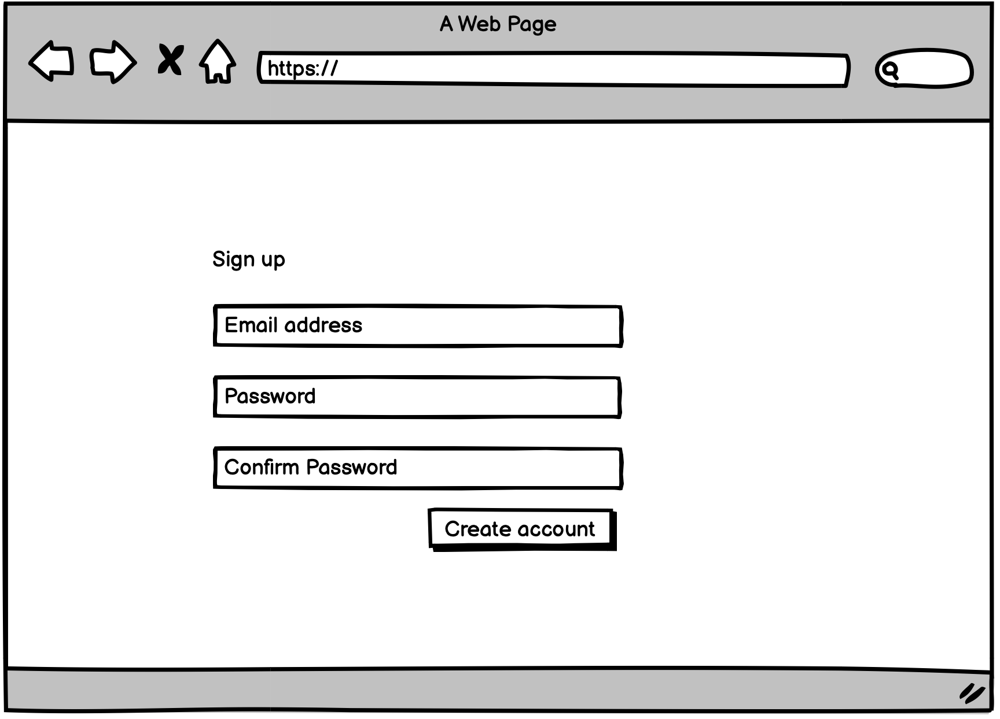
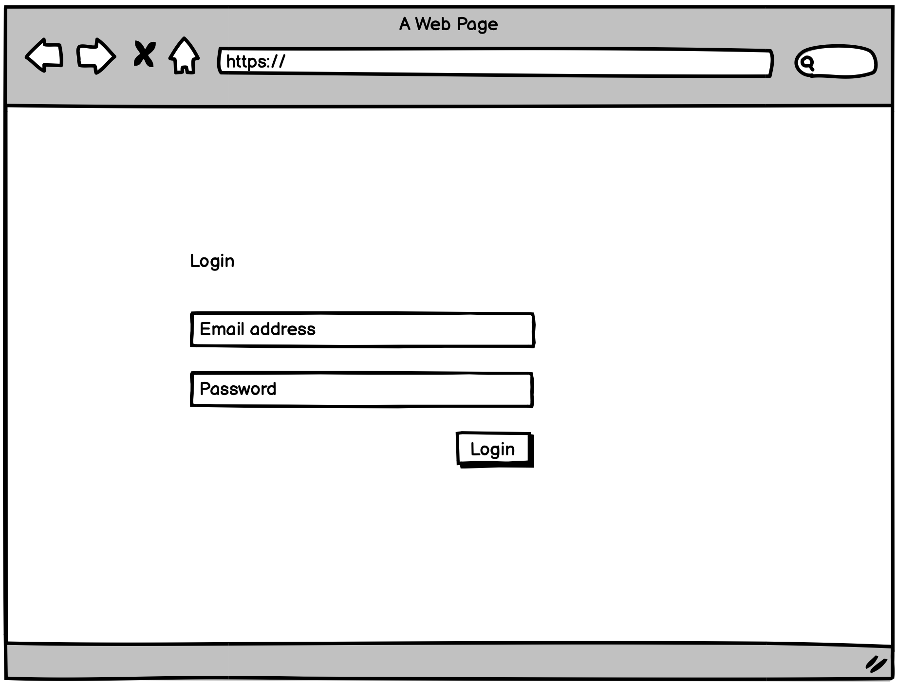
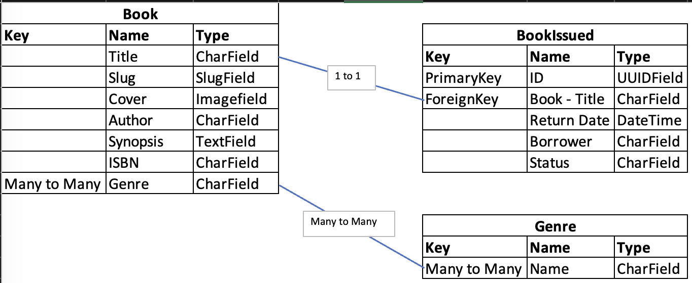

# **_Book Central - Portfolio Project 4_**

The purpose of this website is to provide a library with an online management system. Using this website, users can browse the selection of available books, view the details of each book and check them out for borrowing. Admin users can create, update and delete records. They can also view a list of books on loan with the corresponding user they are on loan with, and the date the book is due to be returned. 

## [View deployed website](https://library-m-system.herokuapp.com/)

# User Experience
## User Stories
I used a Github kanban board with issues to represent individual tasks of my project that will make up my website.
The following objectives were created from admin and user perspectives.

- As a **Site User** I can **register an account** so that **I can view the selection of books and choose one to borrow**
- As a **Site User** I can **view a paginated list of books** so that **I can select a book to view it's details**
- As a **Site User** I can **click a book link** so that **I can view details about the book such as the plot description**
- As a **Site User** I can **check out a book** so that **I can borrow it to read**
- As a **Site User** I can **view a list of the books I have checked out** so that **I can track the number of books and the return dates**
- As a **Site Admin** I can **create, read, update and delete books** so that **I can manage the libraries inventory**
- As a **Site Admin** I can **view all books that are checked out** so that **I can track number of books and return dates per user**
- As a **Site Admin** I can **notify users of a fine** so that **I can apply a penalty for overdue books**

### Guthub project board

### Wireframes
 

<b>Site home page</b>

 

<b>Site book list page</b>

 

<b>Site book detail page</b>

 

<b>Site sign up page</b>

 

<b>Site login page</b>

 

The final designs ended up differing from the wireframe designs. This was simply due to preference of an alternative with the effect on different screen sizes.

### Entity Relationship Diagram
I created the following diagram in MS Excel. It shows the database tables, fields, field types and the relationships.

# Features

