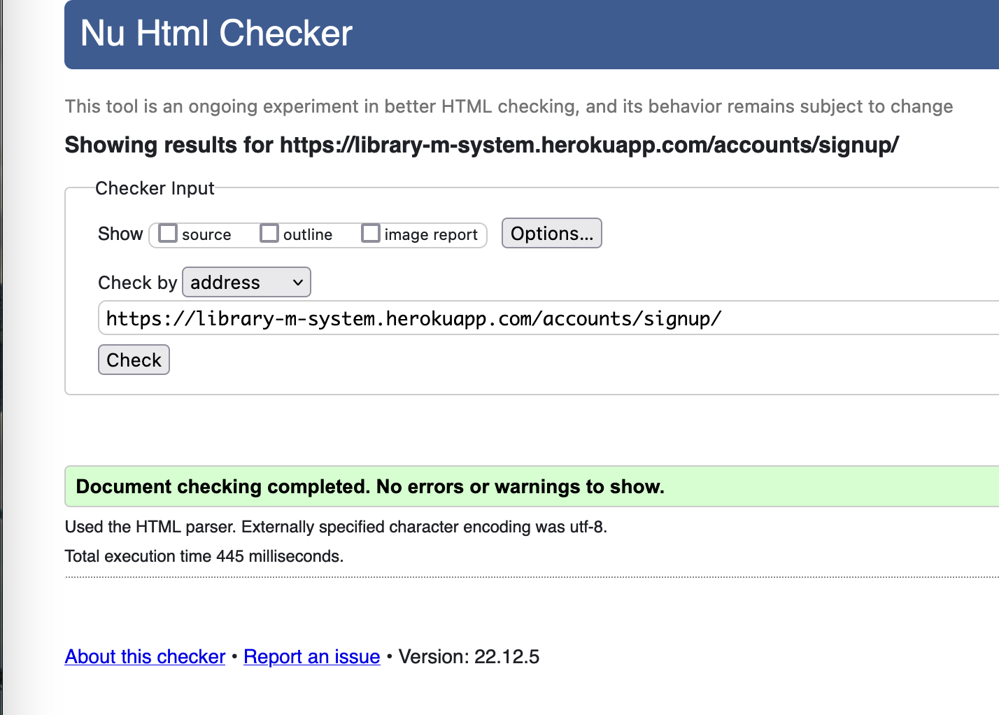
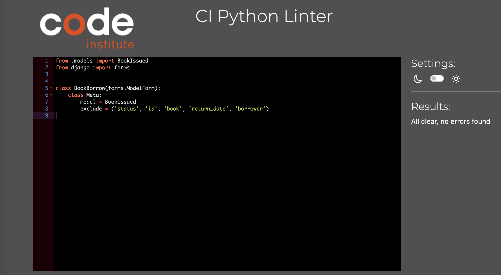
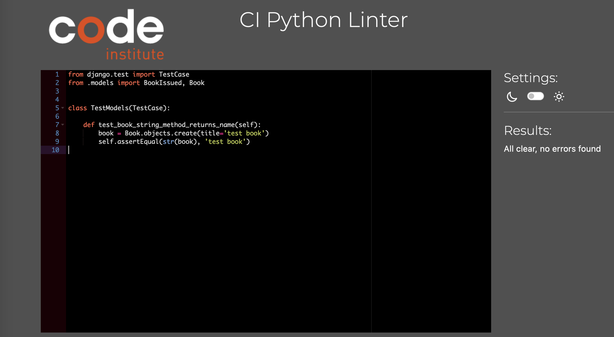
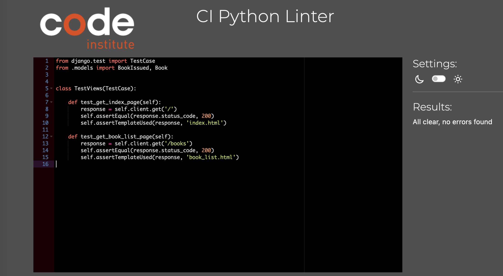
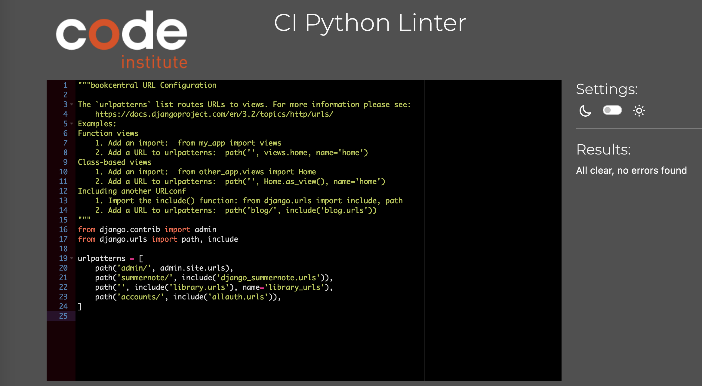

# **_Book Central - Portfolio Project 4_**
## Introduction / Objective
The purpose of this website is to provide a library with an online management system. Using this website, users can browse the selection of available books, view the details of each book and check them out for borrowing. Admin users can create, update and delete records. They can also view a list of books on loan with the corresponding user they are on loan with, and the date the book is due to be returned. 

## [View deployed website](https://library-m-system.herokuapp.com/)

# Contents
* [User Experience](#user-experience)
    * [User Stories](#user-stories)
        * [Github Project Board](#github-project-board)
        * [Wireframes](#wireframes)
        * [Entity Relationship Diagram](#entity-relationship-diagram)
* [Features](#features)
    * [Future Implementations](#future-implementations)
* [Testing](#testing)
    * [HTML](#html)
    * [CSS](#css)
    * [Python](#python)
    * [Lighthouse](#lighthouse)
    * [Automated Testing](#automated-testing)
    * [Erros and Fixes During Development](#errors-and-fixes-during-development)
* [Technologies Used](#technologies-used)
* [Deployment](#deployment)
    * [Elephant SQL](#elephant-sql)
        * [Setting Up Database Connection from Elephant SQL Dashboard](#setting-up-database-connection-from-elephant-sql-dashboard)
    * [Heroku](#heroku)
* [Credits](#credits)
    * [Code](#code)
    * [Content](#content)
    * [Acknowledgements](#acknowledgements)

# User Experience
## User Stories
I used a Github kanban board with issues to represent individual tasks of my project that will make up my website.
The following objectives were created from admin and user perspectives.

- As a **Site User** I can **register an account** so that **I can view the selection of books and choose one to borrow**
- As a **Site User** I can **view a paginated list of books** so that **I can select a book to view it's details**
- As a **Site User** I can **click a book link** so that **I can view details about the book such as the plot description**
- As a **Site User** I can **check out a book** so that **I can borrow it to read**
- As a **Site User** I can **view a list of the books I have checked out** so that **I can track the number of books and the return dates**
- As a **Site Admin** I can **create, read, update and delete books** so that **I can manage the libraries inventory**
- As a **Site Admin** I can **view all books that are checked out** so that **I can track number of books and return dates per user**
- As a **Site Admin** I can **notify users of a fine** so that **I can apply a penalty for overdue books**

### Github Project Board

### Wireframes
 

<b>Site home page</b>

 

<b>Site book list page</b>

 

<b>Site book detail page</b>

 

<b>Site sign up page</b>

 

<b>Site login page</b>

 

The final designs ended up differing from the wireframe designs. This was simply due to preference of an alternative with the effect on different screen sizes.

### Entity Relationship Diagram
I created the following diagram in MS Excel. It shows the database tables, fields, field types and the relationships. This is based on the idea for this project that there is only one copy of each book.

[Back to contents](#contents)

# Features
- __Navigation Bar__
    - The nav bar remains at the top of the page across the site.
    
    - The functionality changes for mobile view.
    
    - Additional options are shown when logged in as an admin.
    

- __Home Page__
    - The home page features the site name in a Google font. I used library style images for the page backgrounds.

- __Footer__
    - The footer features links to social media channels.

- __Register page__
    - Users can create an account using the signup form.
    

- __Login page__
    - Once an account is created, users can sign in. Admin can also login with this form.
    

- __logout page__
    - Once the logout link has been clicked in the nav bar, users are presented with the following form.
    

- __Book List page__
    - The book list page displays a paginated list of the books in the libraries catalog.

- __Book Detail page__
    - The book detail page shows all the fields from the book table including the synopsis, to give users insight into what they can expect from the book. The synopsis section is scrollable within a fixed y-axis length.
    
    - When users are logged in, the page features the checkout button. 
     
    - Once the checkout button is clicked a confirmation message is shown to acknowledge the user's action.  
    
    - When logged in as an admin, additional buttons will be shown for updating and deleting the viewed book.  
     

- __Admin front end CRUD functionality__
    - The link to the Add Book form is on the nav bar when logged in as an admin.
    
    - Update Book form.
    
    - Delete Book form. 
    

- __Books on Loan__
    - Admin users can view a list of the books that are on loan.
    
    
## Future Implementations
- The genres in the nav bar dropdown list all link to the book list page which shows all books. I would like to have implemented a filtered view, only showing books of one genre, matching the genre that the user clicked on in the dropdown list. 
- To import the genres in the navbar list from the Genre database table using the jinja template code. Currently, the genres are hard coded in the list.

Both of the above functions were attempted but I didn't have time resolve the issues that prevented them from working. 

- Once the return date has been exceeded a fine notification is issued to the user to inform them the book is overdue. I have a method to determine if the book is overdue in the BookIssued db model but didn't have time to implement this feature. A reminder email could also be sent to the user when the return date is approaching.

- If a book is checked out, then the checkout button is replaced with an 'on loan' message.
- The number of copies of each book could be added to the database and taken into account regarding the display of the checkout button and 'on loan' message.

- A page for users to view a list of the books they have checked out. I have a user story for this on my Github project board but didn't have time to implement.

[Back to contents](#contents)

# Testing

## HTML
- Book list page HTML
    - I encountered an error on the book list page.

    - I removed the stray div tags.

- Home page HTML

- Book detail page HTML.
    - There was a warning which recommended using a heading tag (h2 - h6) within the section tag for the synopsis field.

- Login page HTML

- Signup page HTML

## CSS
- I received the following result from the CSS validator.

## Python
I have not included files that were left unchanged after initial app installation.

<b>admin.py</b>

 

<b>models.py</b>

 

<b>views.py</b>

 

<b>library/urls.py</b>

 

<b>forms.py</b>

 

<b>test_models.py</b>

 

<b>test_views.py</b>

 

<b>settings.py</b>

 

<b>bookcentral/urls.py</b>

 

## Lighthouse
- Google Chrome Lighthouse report for desktop

- Report for mobile

## Automated Testing
A coverage report was genereated for my Python automated test files.

## Errors and Fixes During Development
- When adding a book from the backend admin account I received the error: TypeError attribute must be string.
In the DB model I had set width and height attributes for the cover ImageField. The values for these attributes were integers which caused the error. The attribute values needed to be variables which contained the integer measurements. These attributes were optional so I removed them. I set the height in width attributes in the html \ tag.

- The book cover image were not appearing on the site. I needed to include the following line of code in the app urls.py file, after the urlpatterns list. 
`+ static(settings.MEDIA_URL, document_root=settings.MEDIA_ROOT)` 

    I also needed to add the following import statements: 
`from django.conf import settings` 
`from django.conf.urls.static import static` 

    The settings.py file included: 
`MEDIA_URL = '/media/'` 
`MEDIA_ROOT = os.path.join(BASE_DIR, 'media')` 

    With all of the above in place, the images displayed on the site and when a new book was created, the cover images were automatically stored in the 'media' directory.

- When trying to add a new book through the front end admin page an error was recieved stating the slug field was missing. This was already working when using the admin backend pages. 
To fix this, I needed to add my own 'save' method to the Book class in models.py. This automatically generated the slug field value. I was then able to add a new book using the front end page.

- I set up a page to show a list of the books on loan. I set this up just like the book list page but none of the records would display.
I had to add the following variable to the BookIssued view class in views.py: 
`context_object_name = 'books_issued'` 
I then referenced the value of this variable in the html template code: 
`` 
The list of records were then displayed on the page.

[Back to contents](#contents)

# Technologies Used
* [Github](https://github.com/) - Version control and host of project file repository.
* [Gitpod](https://gitpod.io) - Development environment.
* [Heroku](https://www.heroku.com) - Live app hosting service
* [HTML5](https://en.wikipedia.org/wiki/HTML5) - The structure of the site content.
* [CSS](https://en.wikipedia.org/wiki/CSS) - The styling and positioning of the content.
* [Python](https://python.org) - Programming language
* [Django](https://www.djangoproject.com/) - Web framework
* [Postgresql](https://www.postgresql.org/) - Open source relational database system
* [Elephant SQL](https://www.elephantsql.com/) - Database hosting service
* [Cloudinary](https://cloudinary.com) - Media file hosting service
* [Google Fonts](https://fonts.google.com/) - Font resource used for the logo.
* [Balsamiq](https://balsamiq.com/) - Wireframe sofware.
* [Am I Responsive](https://ui.dev/amiresponsive) - Responsive design image

[Back to contents](#contents)

# Deployment
## Elephant SQL
Instructions for creating an account on https://www.elephantsql.com/ can be found on Code Institute [here](https://code-institute-students.github.io/deployment-docs/02-elephantsql/elephantsql-01-sign-up)

### Setting Up Database Connection from Elephant SQL Dashboard
1. Click on the 'Create new instance' button.
2. To set up a plan, enter a name and select 'Free' plan.
3. Choose your region.
4. Choose a data center. This field is pre-populated with the suitable option.
5. Click 'Review' and then 'Create instance'.
6. Return to the dashboard and click on the database instance name to view the details.
7. Copy the URL and set this as the value for the DATABASE_URL variable in your app settings.py / env.py files, and for the corresponding config variable in Heroku.

## Heroku
1. Create free account in Heroku.
2. Click 'New' and then 'Create new app'.
3. Enter app name and choose region.
4. Go to the settings tab and click 'Reveal config vars'.
5. Add config variables for the apps security key, database URL, Cloudinary URL and PORT.
6. Add a temporary config var DISABLE_COLLECTSTATIC with a value of 1.
7. Go to the Deploy tab and click the Github button for the deployment method.
8. Enter Github username and repository URL to link account to Heroku.
9. Click 'Deploy branch' to build the latest version of the app that was pushed to Github.
10. Add the heroku app domain name to the ALLOWED_HOSTS variable in the apps settings.py file.
11. For final deployment, delete the DISABLE_COLLECTSTATIC config variable.

[Back to contents](#contents)

# Credits
## Code
The Code Institute Django blog walkthrough project was referenced for this project. I referred to 3 library management system walkthrough projects with regards to setup and resolution of technical issues.

* [Mozilla Djago Tutorial](https://developer.mozilla.org/en-US/docs/Learn/Server-side/Django/Tutorial_local_library_website)
* [Data-Flair Training](https://data-flair.training/blogs/python-online-library-management-system/)
* [TechVidvan Tutorials](https://techvidvan.com/tutorials/python-library-management-system/)

Other sites referred to for instructions / technical issues:
* [StackOverflow](stackoverflow.com/)
* [Learn Djagno - slug tutorial](https://learndjango.com/tutorials/django-slug-tutorial)
* [Django docs](https://docs.djangoproject.com/en/4.1/)
* [Bootstrap docs](https://getbootstrap.com/docs/5.1/getting-started/introduction/)

## Content
Image and book info for Arcade Perfect was taken from [goodreads.com](https://www.goodreads.com/en/book/show/53016601-arcade-perfect). The ISBN was taken from [Amazon](https://www.amazon.co.uk/Arcade-Perfect-Pac-Man-Coin-Op-Classics/dp/1079275541/ref=tmm_pap_swatch_0?_encoding=UTF8&qid=1672224208&sr=8-1).

All other book images and information were taken from the [Waterstones](waterstones.com/) website.

Background images are stock photos taken from [Pexels free stock photos](https://www.pexels.com/).

## Acknowledgements
* Thank you to my mentor, Adegbenga Adeye, for your guidance and for recommending I try an idea outside of my comfort zone. This was a good learning experience.
* Thanks to the staff on the Tutor Support team for their help.

[Back to contents](#contents)